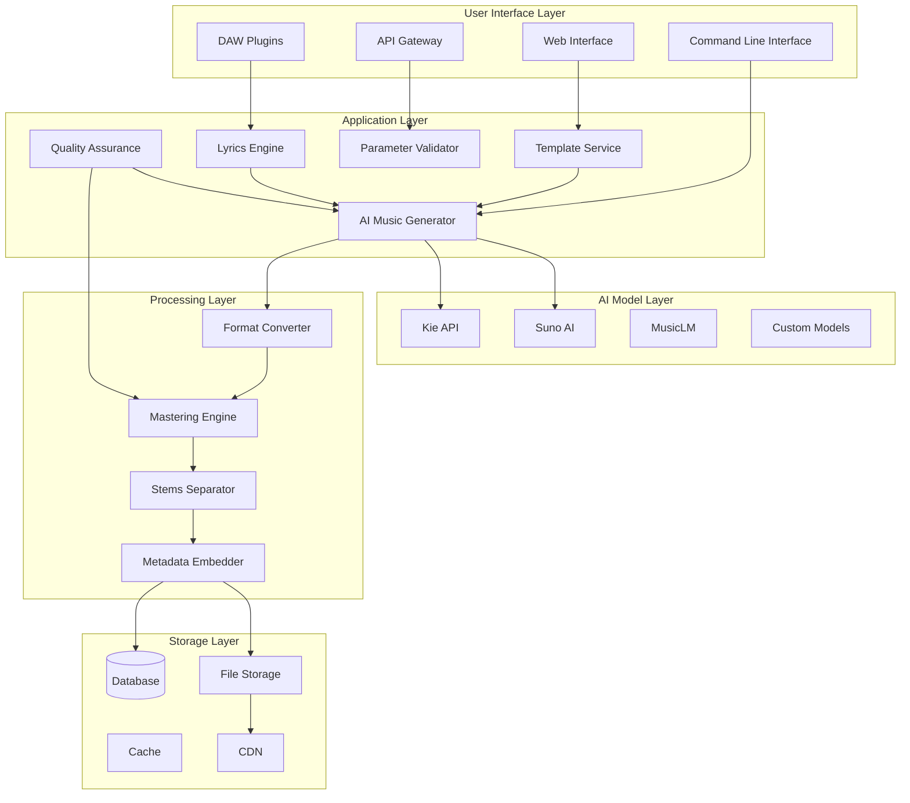

# Comprehensive System Documentation: AI Music Generation System

## Executive Summary

The AI Music Generation System is a comprehensive platform for creating original, royalty-free music tracks using artificial intelligence. The system supports multiple genres, moods, tempos, and offers optional AI-generated lyrics with contextual relevance. Built upon an existing template infrastructure, it provides both standalone application and API access for diverse use cases.

## System Architecture Overview



## Core Components

### 1. Template Enhancement System
- **Purpose**: Extends existing template infrastructure for AI music generation
- **Key Features**:
  - Backward compatibility with existing templates
  - AI-specific parameter extensions
  - Template validation and migration
  - Dynamic template adaptation

### 2. AI Music Generation Engine
- **Purpose**: Orchestrates multiple AI models for music generation
- **Supported Models**:
  - Kie API (primary integration)
  - Suno AI (alternative provider)
  - MusicLM (experimental)
  - Custom fine-tuned models
- **Features**:
  - Model selection based on genre/requirements
  - Fallback mechanisms for reliability
  - Parallel generation for batch processing

### 3. Lyric Generation Module
- **Purpose**: Generates contextually relevant lyrics for vocal tracks
- **Capabilities**:
  - Thematic coherence with musical mood
  - Multiple language support
  - Rhyme scheme generation
  - Vocal melody alignment
- **Quality Metrics**:
  - Thematic consistency scoring
  - Rhyme quality assessment
  - Emotional impact analysis

### 4. Parameter Processing System
- **Purpose**: Validates and transforms user inputs for AI models
- **Validation Rules**:
  - Range validation (tempo: 40-240 BPM, duration: 30-600s)
  - Enum validation (genre, mood, complexity)
  - Dependency validation (lyrics require vocal settings)
  - Consistency validation (key compatibility with genre)

### 5. Output Processing Pipeline
- **Purpose**: Converts AI output to multiple formats with quality enhancement
- **Processing Stages**:
  1. Raw AI output capture
  2. Format conversion (WAV, MP3, FLAC, etc.)
  3. Quality enhancement (EQ, compression, limiting)
  4. Stem separation (drums, bass, melody, vocals)
  5. Metadata embedding
  6. Final delivery packaging

## User Workflow

### 1. Template Selection
```
User → Browse Templates → Filter by Genre/Mood → Preview Examples → Select Template
```

### 2. Parameter Customization
```
Selected Template → Adjust Parameters → Real-time Preview → Validate Settings → Confirm
```

### 3. Generation Process
```
Confirmed Parameters → Queue Generation → AI Processing → Quality Check → Format Conversion
```

### 4. Delivery & Usage
```
Completed Track → Download Formats → Integrate into Project → License Management → Usage Tracking
```

## Technical Specifications

### System Requirements

#### Backend Server
- **CPU**: 8+ cores (for parallel processing)
- **RAM**: 32GB+ (for AI model loading)
- **Storage**: 1TB+ SSD (for audio file storage)
- **Network**: 1Gbps+ (for CDN integration)
- **OS**: Linux (Ubuntu 22.04+ recommended)

#### Development Environment
- **Python**: 3.9+
- **Node.js**: 18+
- **Database**: PostgreSQL 14+
- **Cache**: Redis 7+
- **Message Queue**: RabbitMQ/Celery

### Performance Targets

#### Generation Speed
- **Simple Tracks** (30-60s): < 30 seconds
- **Standard Tracks** (2-3min): < 60 seconds
- **Complex Tracks** (4-5min): < 120 seconds
- **Batch Processing**: Linear scaling with concurrent workers

#### System Capacity
- **Concurrent Users**: 1000+ simultaneous
- **Daily Generations**: 10,000+ tracks
- **Storage Capacity**: 100TB+ with tiered storage
- **Uptime**: 99.9% SLA

### Quality Standards

#### Audio Quality Metrics
- **Loudness**: -14 LUFS ±1dB (streaming standard)
- **Dynamic Range**: > 8dB (for musicality)
- **Frequency Balance**: 20Hz-20kHz coverage
- **Stereo Image**: Proper width and phase coherence

#### Musical Quality Metrics
- **Melodic Coherence**: > 0.8 score (0-1 scale)
- **Harmonic Consistency**: > 0.85 score
- **Rhythmic Stability**: > 0.9 score
- **Structural Integrity**: Clear section definitions

## Integration with Existing System

### Template System Integration
```python
# Example: Hybrid template service supporting both cover and AI generation
class HybridTemplateService:
    def __init__(self):
        self.template_service = TemplateService()
        self.ai_template_service = AITemplateService()
    
    def get_template(self, template_id: str, generation_type: str = None):
        """Get template with type-aware filtering."""
        template = self.template_service.get_template_by_id(template_id)
        
        # Determine template type
        template_type = template.get('template_type', 'cover_generation')
        
        if generation_type and template_type != generation_type:
            # Convert template if needed
            if generation_type == 'ai_generation':
                return self._convert_to_ai_template(template)
        
        return template
    
    def generate_music(self, template_id: str, **kwargs):
        """Generate music using appropriate method."""
        template = self.get_template(template_id)
        template_type = template.get('template_type', 'cover_generation')
        
        if template_type == 'ai_generation':
            return self.ai_template_service.generate_from_template(template, **kwargs)
        else:
            # Use existing cover generation logic
            return self.template_service.apply_template(template, **kwargs)
```

### API Endpoint Integration
```python
# Example: New AI generation endpoints added to existing API
@api_bp.route('/ai/generate', methods=['POST'])
@login_required
def ai_generate_music():
    """Generate original music using AI."""
    try:
        data = request.json
        parameters = data.get('parameters', {})
        
        # Validate parameters
        validator = AIParameterValidator()
        is_valid, errors = validator.validate(parameters)
        if not is_valid:
            return jsonify({'error': 'Invalid parameters', 'details': errors}), 400
        
        # Generate music
        ai_service = AIMusicGenerationService()
        generation_id = ai_service.generate_music(
            parameters=parameters,
            user_id=current_user.id,
            callback_url=data.get('callback_url')
        )
        
        return jsonify({
            'generation_id': generation_id,
            'status': 'queued',
            'estimated_completion': ai_service.get_estimated_completion(generation_id)
        })
        
    except Exception as e:
        current_app.logger.error(f"AI generation error: {e}")
        return jsonify({'error': str(e)}), 500
```

## Security Considerations

### 1. Authentication & Authorization
- **API Keys**: Tier-based access with rate limiting
- **JWT Tokens**: Stateless authentication for web/mobile
- **OAuth 2.0**: Third-party application integration
- **Role-Based Access**: User, pro, enterprise permissions

### 2. Data Protection
- **Encryption**: AES-256 for data at rest, TLS 1.3 for data in transit
- **Anonymization**: User data anonymization for training
- **Data Retention**: Configurable retention policies
- **GDPR Compliance**: Right to erasure, data portability

### 3. Content Safety
- **Lyric Filtering**: Profanity and inappropriate content detection
- **Copyright Checking**: Similarity analysis with copyrighted works
- **Content Moderation**: Automated and manual review systems
- **Usage Monitoring**: Detection of abusive generation patterns

## Scalability Strategy

### Horizontal Scaling
- **Stateless Services**: API servers can be scaled independently
- **Worker Pools**: Generation workers scale based on queue depth
- **Database Sharding**: User data sharded by region/usage
- **CDN Distribution**: Global content delivery network

### Vertical Optimization
- **Model Caching**: Frequently used AI models kept in memory
- **Result Caching**: Similar generation results cached
- **Connection Pooling**: Database and external API connections
- **Compression**: Audio and data compression for storage/transit

### Load Management
- **Queue Prioritization**: Pro users get higher priority
- **Rate Limiting**: Tier-based request limits
- **Circuit Breakers**: Fail-fast for external service failures
- **Auto-scaling**: Cloud-based auto-scaling based on metrics

## Monitoring & Analytics

### System Metrics
- **Generation Success Rate**: Track completion vs failure rates
- **Generation Time**: Average and percentile completion times
- **Resource Utilization**: CPU, memory, storage usage
- **Error Rates**: API error rates by endpoint

### Business Metrics
- **User Engagement**: Active users, generations per user
- **Quality Scores**: User ratings and feedback
- **Revenue Metrics**: Subscription conversions, usage tiers
- **Content Popularity**: Most used templates and parameters

### Quality Metrics
- **Audio Quality Scores**: Automated quality assessment
- **User Satisfaction**: Direct feedback and ratings
- **Retention Rates**: User return rates
- **Bug Reports**: System issues and fixes

## Deployment Architecture

### Development Environment
- **Local Development**: Docker Compose for local services
- **CI/CD Pipeline**: Automated testing and deployment
- **Feature Flags**: Gradual feature rollout
- **A/B Testing**: Experimental feature testing

### Staging Environment
- **Production-like Setup**: Mirrors production architecture
- **Load Testing**: Performance and stress testing
- **Integration Testing**: Third-party service integration
- **User Acceptance Testing**: Beta user feedback collection

### Production Environment
- **Multi-region Deployment**: Geographic redundancy
- **Blue-Green Deployment**: Zero-downtime updates
- **Disaster Recovery**: Backup and recovery procedures
- **Monitoring Stack**: Comprehensive observability

## Licensing Model

### Usage Tiers

#### Free Tier
- **Generations**: 10 tracks per month
- **Quality**: Standard quality (192kbps MP3)
- **Formats**: MP3 only
- **License**: Personal use only
- **Watermark**: Audio watermark applied

#### Pro Tier ($29/month)
- **Generations**: Unlimited
- **Quality**: High quality (320kbps MP3, 24-bit WAV)
- **Formats**: All formats (WAV, MP3, FLAC, MIDI)
- **License**: Commercial use allowed
- **Features**: Batch generation, API access

#### Enterprise Tier (Custom)
- **Generations**: Custom limits
- **Quality**: Studio quality (24-bit/96kHz)
- **Formats**: All formats + stems + project files
- **License**: Extended commercial rights
- **Features**: White-label, custom models, SLA

### Royalty-Free Guarantee
- **All generated music is 100% royalty-free**
- **No additional fees for commercial use**
- **Worldwide distribution rights**
- **Perpetual license (no expiration)**

## Roadmap & Future Enhancements

### Phase 1: Core MVP (Months 1-3)
- Basic AI music generation
- Template system integration
- Web interface
- MP3/WAV output formats

### Phase 2: Enhanced Features (Months 4-6)
- Lyric generation
- Multiple AI model support
- Advanced parameter controls
- Batch generation
- Mobile applications

### Phase 3: Professional Features (Months 7-9)
- Stem separation
- DAW plugin integration
- Advanced mastering
- Quality assurance system
- API ecosystem

### Phase 4: Advanced Capabilities (Months 10-12)
- Real-time collaboration
- Custom model training
- Blockchain licensing
- Social features
- Marketplace integration

## Success Criteria

### Technical Success
- **System Uptime**: > 99.9% availability
- **Generation Speed**: < 60 seconds for 3-minute tracks
- **Error Rate**: < 1% generation failures
- **Scalability**: Support 10,000+ daily generations

### User Success
- **User Satisfaction**: > 4.5/5 average rating
- **Retention Rate**: > 40% monthly active user retention
- **Net Promoter Score**: > 50 NPS
- **Feature Adoption**: > 60% of users using advanced features

### Business Success
- **Revenue Growth**: > 20% month-over-month growth
- **Customer Acquisition Cost**: < $50 per paying customer
- **Lifetime Value**: > 12 months average customer lifetime
- **Market Share**: > 10% of AI music generation market

## Conclusion

The AI Music Generation System represents a comprehensive solution for creating original, royalty-free music using artificial intelligence. By leveraging and extending the existing template infrastructure, the system provides a robust foundation for both standalone application usage and API-based integration. With support for multiple genres, moods, tempos, and AI-generated lyrics, the system addresses a wide range of use cases from casual content creation to professional music production.

The architecture is designed for scalability, reliability, and quality, with comprehensive monitoring, security, and business intelligence capabilities. The phased implementation roadmap ensures gradual feature rollout while maintaining system stability and user satisfaction.

This system positions itself as a leader in the AI music generation space, combining technical innovation with practical usability and commercial viability.