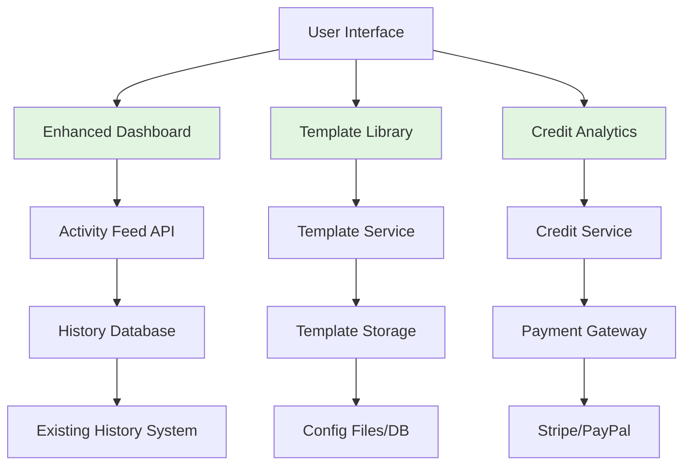

# Index Page Analysis & High-Impact Feature Proposal

## Current State Analysis

### Layout & Content
- **Dashboard-style interface** with sidebar navigation, main content area, and sticky audio player
- **Primary function**: AI music generation from text prompts (different from cover generation)
- **Navigation**: Links to Cover Generator, History, and placeholder sections (Library, Explore)
- **User flow**: Create → Generate → View results → Access history

### Identified UX Pain Points
1. **Confusing navigation** - Index page for AI generation vs Cover Generator for main feature
2. **Empty/placeholder content** - Library and Explore sections non-functional
3. **No clear value proposition** - Users may not understand the tool's purpose
4. **Limited feedback** - No progress indicators for generations
5. **Credits lack context** - "500 CREDITS" shown without explanation
6. **Recent Generations shows placeholders** - Not actual user history

## Proposed High-Impact Features (7 Total)

### 1. Unified Dashboard with Activity Feed
**What**: Replace placeholder "Recent Generations" with real-time activity feed showing user's actual generations, cover creations, and video productions.

**Why**: 
- User Value: Immediate visibility into past work, quick access to results
- Business Value: Increased engagement, showcases product capabilities
- UX Improvement: Eliminates confusing placeholder content

**Where**: Main content area of index page, replacing current "Recent Generations" section

**Implementation**:
- Frontend: New React/Vue component fetching from `/api/user-activity`
- Backend: New endpoint aggregating history, generations, and callback data
- Database: Enhanced user activity tracking (if not already in history.json)
- Effort: **Medium** (requires new API endpoints and frontend components)

### 2. Credit System & Usage Analytics
**What**: Transform static "500 CREDITS" display into interactive system with usage tracking, credit purchase options, and cost breakdowns.

**Why**:
- User Value: Understand costs, manage budget, plan usage
- Business Value: Clear monetization path, user retention through transparency
- UX Improvement: Makes abstract credits tangible and meaningful

**Where**: Header area (current credits display) + new analytics dashboard section

**Implementation**:
- Frontend: Credit usage charts, purchase modal, real-time updates
- Backend: Credit tracking middleware, Stripe/PayPal integration
- Database: User credit balance table, transaction history
- Effort: **Large** (payment integration, tracking system, UI components)

### 3. Template Library & Style Presets
**What**: Curated collection of pre-configured styles, genres, and templates for quick generation without manual prompt engineering.

**Why**:
- User Value: Faster results, inspiration, professional-quality outputs
- Business Value: Reduces user friction, showcases AI capabilities
- UX Improvement: Guides new users, reduces cognitive load

**Where**: New section below prompt input or as modal/panel

**Implementation**:
- Frontend: Template gallery with previews, one-click application
- Backend: Template storage (JSON/config files), preset application logic
- Database: Optional template metadata storage
- Effort: **Small-Medium** (mostly frontend with configuration files)

### 4. Enhanced Sharing & Export Options
**What**: Social sharing buttons, embed codes, and multiple export formats (MP3, WAV, video, project files).

**Why**:
- User Value: Easy distribution, professional presentations, portfolio building
- Business Value: Viral growth through sharing, increased tool utility
- UX Improvement: Completes the creation → sharing workflow

**Where**: On each generation result card and in audio/video players

**Implementation**:
- Frontend: Share modal, export format selector, embed code generator
- Backend: File conversion services, social media meta tag generation
- External: Integration with social platforms (Twitter, Instagram, TikTok)
- Effort: **Medium** (file conversion complexity, social API integrations)

### 5. Advanced Audio Preview & Editing
**What**: In-browser waveform visualization, basic audio editing (trim, fade, normalize), and A/B comparison of generated versions.

**Why**:
- User Value: Professional-grade tool within browser, no external software needed
- Business Value: Differentiates from competitors, attracts professional users
- UX Improvement: Immediate feedback and control over outputs

**Where**: Integrated into audio player components and generation results

**Implementation**:
- Frontend: Web Audio API, waveform libraries (Wavesurfer.js), editing UI
- Backend: Audio processing endpoints (trim, normalize, etc.)
- Storage: Temporary edit files management
- Effort: **Large** (complex audio processing, real-time visualization)

### 6. Project Management & Organization
**What**: Workspaces, project folders, collaboration features, and version history for organized music production.

**Why**:
- User Value: Professional workflow organization, team collaboration
- Business Value: Enterprise/team plans potential, user lock-in
- UX Improvement: Scales for power users with many creations

**Where**: New sidebar section replacing placeholder "Library"

**Implementation**:
- Frontend: Project browser, folder management, sharing controls
- Backend: Project/workspace CRUD, collaboration permissions
- Database: Project schema, user permissions, version history
- Effort: **Large** (full CRUD system, permissions, collaboration features)

### 7. Batch Processing & Queue Management
**What**: Process multiple audio files or generate multiple variations simultaneously with queue management and priority settings.

**Why**:
- User Value: Time savings for bulk operations, efficient workflow
- Business Value: Attracts professional/commercial users with high-volume needs
- UX Improvement: Handles real-world production scenarios

**Where**: New "Batch" mode in upload/generation interfaces

**Implementation**:
- Frontend: Batch upload UI, queue visualization, progress tracking
- Backend: Job queue system (Redis/Celery), parallel processing management
- Database: Batch job tracking, result aggregation
- Effort: **Large** (queue system, parallel processing, error handling)

## Prioritization Matrix

| Feature | User Impact | Business Value | Implementation Effort | Priority |
|---------|-------------|----------------|----------------------|----------|
| 1. Unified Dashboard | High | High | Medium | **P1** |
| 2. Credit System | High | High | Large | **P1** |
| 3. Template Library | High | Medium | Small-Medium | **P1** |
| 4. Enhanced Sharing | Medium | High | Medium | **P2** |
| 5. Audio Preview/Editing | Medium | Medium | Large | **P2** |
| 6. Project Management | Low-Medium | Medium | Large | **P3** |
| 7. Batch Processing | Low | Medium | Large | **P3** |

## Recommended Implementation Roadmap

### Phase 1 (Quick Wins - 2-4 weeks)
1. **Unified Dashboard** - Replace placeholders with real data
2. **Template Library** - Basic preset collection
3. **Enhanced Sharing** - Basic export and share options

### Phase 2 (Core Enhancements - 4-8 weeks)
4. **Credit System** - Full implementation with analytics
5. **Audio Preview** - Basic waveform visualization

### Phase 3 (Advanced Features - 8-12+ weeks)
6. **Project Management** - Full workspace system
7. **Batch Processing** - Queue management system

## System Architecture Impact

## Success Metrics

1. **User Engagement**: Time on site, generations per user
2. **Conversion**: Free to paid user conversion rate
3. **Retention**: Weekly active users, repeat usage
4. **Satisfaction**: User feedback, support ticket reduction
5. **Growth**: Social shares, referral traffic

## Risk Mitigation

1. **Technical Complexity**: Start with Phase 1 features to validate approach
2. **User Adoption**: Conduct user testing before full implementation
3. **Performance**: Implement caching for activity feeds and analytics
4. **Costs**: Monitor API usage with credit system to prevent abuse

## Conclusion

The proposed features address core UX issues while expanding the platform's capabilities. Starting with the Unified Dashboard, Template Library, and Enhanced Credit System provides immediate user value with manageable implementation effort. These improvements will transform the index page from a confusing placeholder-filled interface into a powerful, engaging dashboard that clearly communicates value and drives user engagement.