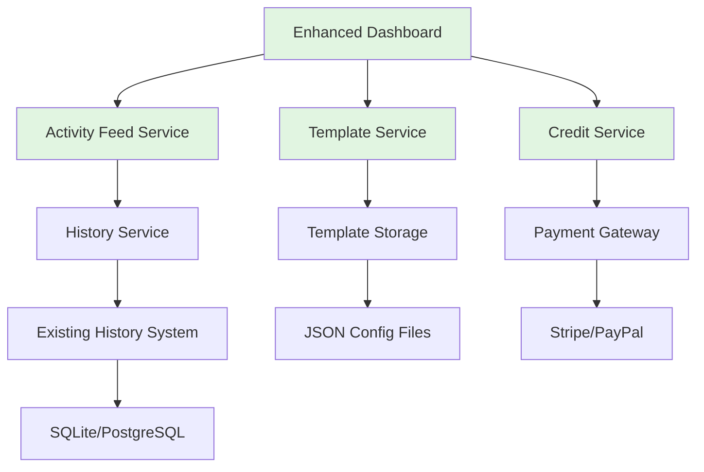

# Enhanced Index Page Analysis & Feature Implementation Plan

## Executive Summary

Based on comprehensive analysis of the current `index.html` implementation and existing 7-feature proposal, this document provides an enhanced, actionable roadmap for transforming the dashboard into a production-ready music generation platform. The current implementation shows strong technical foundations but suffers from UX gaps and placeholder content.

## Current State Assessment

### Strengths
- **Solid Architecture**: Flask backend with modular routes, services, and API clients
- **Core Functionality**: Music generation, cover creation, video generation, and history tracking
- **Modern UI**: Tailwind CSS with dark/light theme support
- **User Authentication**: Flask-Login integration with profile management
- **API Integration**: Kie API client with comprehensive error handling
- **History System**: 15-day retention with detailed callback tracking

### Critical Gaps Identified
1. **Dashboard Confusion**: Index page shows AI music generation while main feature is cover generation
2. **Placeholder Content**: "Recent Generations" shows fake data, not user history
3. **Navigation Issues**: Sidebar has non-functional sections (Library, Explore)
4. **Credit System**: Static display without actual tracking or monetization
5. **Missing Analytics**: No usage statistics or progress tracking
6. **Limited Sharing**: Basic download functionality but no social sharing
7. **No Templates**: Users must craft prompts from scratch

## Enhanced Feature Specifications

### 1. Unified Activity Dashboard (P1 - High Impact)
**Problem**: Users can't see their actual work history on the main dashboard
**Solution**: Replace placeholder "Recent Generations" with real-time activity feed

**Specifications**:
- **Frontend**: New activity feed component showing:
  - Cover generation results (from `/api/history`)
  - Music video creations
  - User statistics (generations/week, success rate)
  - Quick access to recent outputs
- **Backend**: New `/api/user-activity` endpoint aggregating:
  - History service data
  - User-specific generation counts
  - Success/failure statistics
- **UI Components**:
  - Activity cards with audio/video previews
  - Filter by date/type/success
  - One-click regeneration
  - Batch operations

**Technical Feasibility**: HIGH - Leverages existing history system

### 2. Credit & Usage Analytics System (P1 - Monetization)
**Problem**: "500 CREDITS" display is static and meaningless
**Solution**: Implement real credit tracking with analytics

**Specifications**:
- **Database Schema**:
  ```sql
  user_credits (user_id, balance, last_updated)
  credit_transactions (id, user_id, amount, type, description, timestamp)
  usage_logs (id, user_id, task_id, cost, timestamp)
  ```
- **Frontend Components**:
  - Interactive credit dashboard
  - Usage charts (daily/weekly/monthly)
  - Cost breakdown per generation type
  - Purchase modal (Stripe/PayPal integration)
- **Backend Services**:
  - Credit deduction middleware
  - Usage tracking service
  - Payment gateway integration
  - Free tier management

**Technical Feasibility**: MEDIUM - Requires database changes and payment integration

### 3. Template Library & Style Presets (P1 - UX Improvement)
**Problem**: New users struggle with prompt engineering
**Solution**: Curated template collection with one-click generation

**Specifications**:
- **Template Categories**:
  - Music Genres (Synthwave, Lo-fi, Orchestral)
  - Mood/Atmosphere (Energetic, Relaxing, Dark)
  - Use Cases (Background Music, Podcast Intro, Game Soundtrack)
- **Implementation**:
  - JSON template storage (`/app/templates/`)
  - Template preview with audio samples
  - Customizable parameters
  - User template saving
- **UI Components**:
  - Template gallery with search/filter
  - Preview modal with audio samples
  - "Use Template" button with auto-filled prompts

**Technical Feasibility**: HIGH - Configuration-based, minimal backend changes

### 4. Enhanced Sharing & Export (P2 - Growth)
**Problem**: Limited distribution options for created content
**Solution**: Multi-format export and social sharing

**Specifications**:
- **Export Formats**:
  - Audio: MP3, WAV, FLAC
  - Video: MP4 with customizable resolutions
  - Project: JSON with all parameters
  - Social Media: Optimized formats for platforms
- **Sharing Features**:
  - One-click social sharing (Twitter, Instagram, TikTok)
  - Embed codes for websites
  - Public/private sharing links
  - QR code generation for mobile sharing
- **Backend Services**:
  - File conversion service (FFmpeg integration)
  - Social media API integrations
  - Link shortening service

**Technical Feasibility**: MEDIUM - Requires external service integrations

### 5. Advanced Audio Preview & Editing (P2 - Professional Features)
**Problem**: Basic audio player lacks professional features
**Solution**: In-browser waveform visualization and editing

**Specifications**:
- **Waveform Visualization**:
  - Web Audio API integration
  - Real-time waveform display
  - Playhead tracking
  - Zoom/pan controls
- **Basic Editing**:
  - Trim start/end points
  - Fade in/out
  - Volume normalization
  - Simple EQ adjustments
- **A/B Comparison**:
  - Side-by-side audio comparison
  - Version history
  - Export comparison notes

**Technical Feasibility**: MEDIUM - Requires Web Audio API expertise

### 6. Project Management & Organization (P3 - Power Users)
**Problem**: No organization for multiple generations
**Solution**: Workspace and project management system

**Specifications**:
- **Project Structure**:
  - Workspaces (personal, team, client)
  - Project folders with tags
  - Version history
  - Collaboration permissions
- **Features**:
  - Drag-and-drop organization
  - Bulk operations
  - Project sharing
  - Export project bundles
- **Database Schema**:
  - Projects table with user permissions
  - Folder hierarchy
  - Sharing settings

**Technical Feasibility**: MEDIUM-HIGH - Full CRUD system with permissions

### 7. Batch Processing & Queue Management (P3 - Enterprise)
**Problem**: Single-file processing limits workflow efficiency
**Solution**: Batch upload and processing with queue management

**Specifications**:
- **Batch Features**:
  - Multiple file upload
  - Template application to batch
  - Queue visualization
  - Priority settings
  - Pause/resume/cancel
- **Technical Implementation**:
  - Redis/Celery for job queues
  - Parallel processing management
  - Progress tracking
  - Error handling and retries
- **UI Components**:
  - Batch upload interface
  - Queue status dashboard
  - Email notifications
  - Batch result aggregation

**Technical Feasibility**: HIGH - Complex but uses established patterns

## Implementation Roadmap

### Phase 1: Foundation (Weeks 1-4)
**Goal**: Fix critical UX issues and deliver immediate value

1. **Week 1-2**: Unified Activity Dashboard
   - Create `/api/user-activity` endpoint
   - Build activity feed component
   - Replace placeholder content with real data
   - Add filtering and search

2. **Week 3-4**: Template Library v1
   - Create template JSON structure
   - Build template gallery UI
   - Implement one-click template application
   - Add 20+ curated templates

### Phase 2: Monetization & Sharing (Weeks 5-8)
**Goal**: Enable revenue and growth features

3. **Week 5-6**: Credit System Core
   - Database schema implementation
   - Credit tracking middleware
   - Basic analytics dashboard
   - Free tier management

4. **Week 7-8**: Enhanced Sharing v1
   - Multi-format export (MP3, WAV, MP4)
   - Social sharing buttons
   - Embed code generator
   - Public/private links

### Phase 3: Professional Features (Weeks 9-12)
**Goal**: Attract professional users and improve workflow

5. **Week 9-10**: Audio Preview & Editing
   - Waveform visualization
   - Basic trimming and fading
   - A/B comparison
   - Export edited versions

6. **Week 11-12**: Project Management v1
   - Basic project organization
   - Folder management
   - Bulk operations
   - Simple sharing

### Phase 4: Advanced & Enterprise (Weeks 13-16+)
**Goal**: Scale for power users and teams

7. **Week 13-14**: Credit System Advanced
   - Payment gateway integration
   - Advanced analytics
   - Team billing
   - Usage alerts

8. **Week 15-16**: Batch Processing
   - Queue system implementation
   - Batch upload interface
   - Progress tracking
   - Error handling

## Technical Architecture Impact



## Success Metrics & KPIs

### User Engagement
- **Daily Active Users (DAU)**: Target 50% increase
- **Time on Site**: Target 30% increase
- **Generations per User**: Target 2.5x increase

### Business Metrics
- **Conversion Rate**: Free to paid users
- **Revenue per User**: Monthly recurring revenue
- **Customer Acquisition Cost**: Through sharing features

### Technical Metrics
- **API Response Time**: < 500ms for dashboard
- **Error Rate**: < 1% for core features
- **Uptime**: 99.9% for critical services

## Risk Mitigation

### Technical Risks
1. **API Rate Limiting**: Implement caching for Kie API calls
2. **File Storage Costs**: Use CDN for generated content
3. **Browser Compatibility**: Progressive enhancement strategy

### Business Risks
1. **User Adoption**: A/B testing for new features
2. **Payment Integration**: Start with Stripe only, expand later
3. **Content Moderation**: Automated + manual review system

### Implementation Risks
1. **Scope Creep**: Strict phase-based delivery
2. **Technical Debt**: Weekly code review and refactoring
3. **Team Capacity**: Focus on Phase 1 before committing to Phase 2

## Conclusion

The enhanced feature plan addresses the core UX issues while building a scalable platform for growth. Starting with Phase 1 delivers immediate user value with manageable technical complexity. Each subsequent phase builds on established foundations, minimizing risk while maximizing impact.

**Recommended Next Steps**:
1. Implement Unified Activity Dashboard (Phase 1, Week 1-2)
2. Conduct user testing with prototype
3. Adjust roadmap based on feedback
4. Proceed with Template Library implementation

This plan transforms the index page from a confusing placeholder interface into a powerful, engaging dashboard that clearly communicates value and drives user engagement.